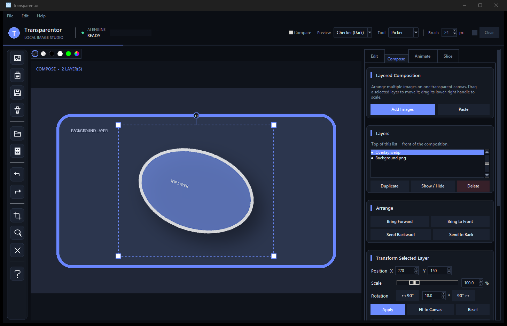

# Transparentor

Transparentor is a Windows desktop image-cleanup and lightweight composition tool for artists, game developers, and UI designers. It combines local AI background removal with layered image arrangement, chroma keying, alpha refinement, GIF assembly, and sprite-sheet slicing in one desktop interface.



## Features

- Adaptive Fusion background removal as the default, combining BiRefNet's clean
  silhouettes and chroma-screen separation with ISNet's glow, particles, and
  fine detached-detail retention
- Dedicated BiRefNet and ISNet modes remain available for faster or
  model-specific workflows
- Segmented, stage-aware AI progress with elapsed time and a locally learned ETA
- Edit-mode multi-image drop queue with a live filmstrip, sequential one-click
  background removal, current-image preview, and retained results
- DirectML acceleration for supported models, with CPU fallback
- Chroma-key controls, spill cleanup, edge blending, and anti-aliasing
- Screen-aware translucent matting for noisy or brightness-gradient green/blue
  backgrounds, with foreground-color reconstruction instead of a flat-color key
- Exact pixel and percentage resizing with aspect-ratio lock and quality selection
- Coordinate-based or drag-to-select cropping, lasso protection, undo/redo, clipboard paste, and drag-and-drop
- Cohesive modern outline icons throughout the left editor rail
- Responsive, non-destructive multi-image composition with move, proportional
  scaling, rotation, flips, opacity, color adjustments, blur, drop shadows,
  visibility, duplication, and front/back layer ordering
- PNG and lossless WebP export with transparency
- Multi-resolution Windows ICO export with compatibility-oriented 16–256 px frames
- Batch background removal with PNG or WebP output, a live main-canvas preview, and a queue filmstrip
- PNG/WebP-frame animation preview, GIF export, and PNG/WebP frame export
- Sprite-sheet slicing with PNG/WebP export, presets, custom names, trimming, and GIF handoff
- Portable, self-contained Transparentor project files

Images are processed locally. When a model is used for the first time,
Transparentor shows its download size and cache location and asks for permission
before downloading it from the official `rembg` model release.

## Download

For most users, download `Transparentor.exe` from the repository's **Releases** page. The application is currently built for 64-bit Windows.

The executable is intentionally not stored in the Git repository. GitHub blocks ordinary repository files larger than 100 MiB, so packaged builds are distributed as release assets.

> Windows may show a SmartScreen warning because the executable is not code-signed. If you downloaded it from the official Transparentor release page, use Windows' **More info** option to inspect the publisher and file details before deciding whether to run it.

## First run

The executable contains the application and Python dependencies, but it does not
bundle every AI model. The first AI run needs an internet connection.
Transparentor asks before downloading approximately:

- ISNet General Use: 179 MB
- BiRefNet Massive: 973 MB
- Fusion: both models, approximately 1.15 GB total

Downloaded model files are cached in the user's `.u2net` directory. Normal editing, GIF, and slicer features do not upload images to a remote service.

## Projects

Transparentor 1.1 projects are self-contained `.tpr` packages. They embed the
editor source, committed edits and AI masks, lasso protection, composition
layers and transforms, slicer source and settings, and GIF frames and settings.
A project can be moved to another folder or computer without carrying its
original image files alongside it.

Legacy JSON/path-based Transparentor projects can still be opened. If a legacy
source image is missing, the app asks you to locate it.

## Run from source

Requirements:

- Windows 10 or Windows 11, 64-bit
- Python 3.13
- An internet connection for dependency installation and first-time AI model downloads

```powershell
git clone <repository-url>
cd Transparentor
py -3.13 -m venv .venv
.\.venv\Scripts\Activate.ps1
python -m pip install --upgrade pip
python -m pip install -r requirements.txt
pythonw .\Transparentor.pyw
```

## Build the Windows executable

Install the development requirements, then run the included build script:

```powershell
python -m pip install -r requirements-dev.txt
powershell -ExecutionPolicy Bypass -File .\build_transparentor.ps1 -Clean
```

The packaged application and release notices are written to `dist`.

## Keyboard shortcuts

- `Ctrl+O`: open an image
- `Ctrl+S`: save/export
- `Ctrl+V`: paste an image
- `Ctrl+B`: batch AI background removal
- `Ctrl+Z` / `Ctrl+Y`: undo/redo
- `F1`: open the built-in help

## Privacy and diagnostics

Image processing runs on the local computer. AI model weights are downloaded directly from the URLs configured in the application. Transparentor's ONNX AI runs inside the app process; closing Transparentor signals its workers, releases its cached model sessions, and terminates that process. Transparentor does not launch or use `llama-server`. Crash and provider diagnostics may be written under `%LOCALAPPDATA%\Transparentor\logs`.

## License

Transparentor is released under the [MIT License](LICENSE). Third-party
dependencies and downloaded AI model files retain their own licenses; see
[THIRD_PARTY_NOTICES.md](THIRD_PARTY_NOTICES.md).
